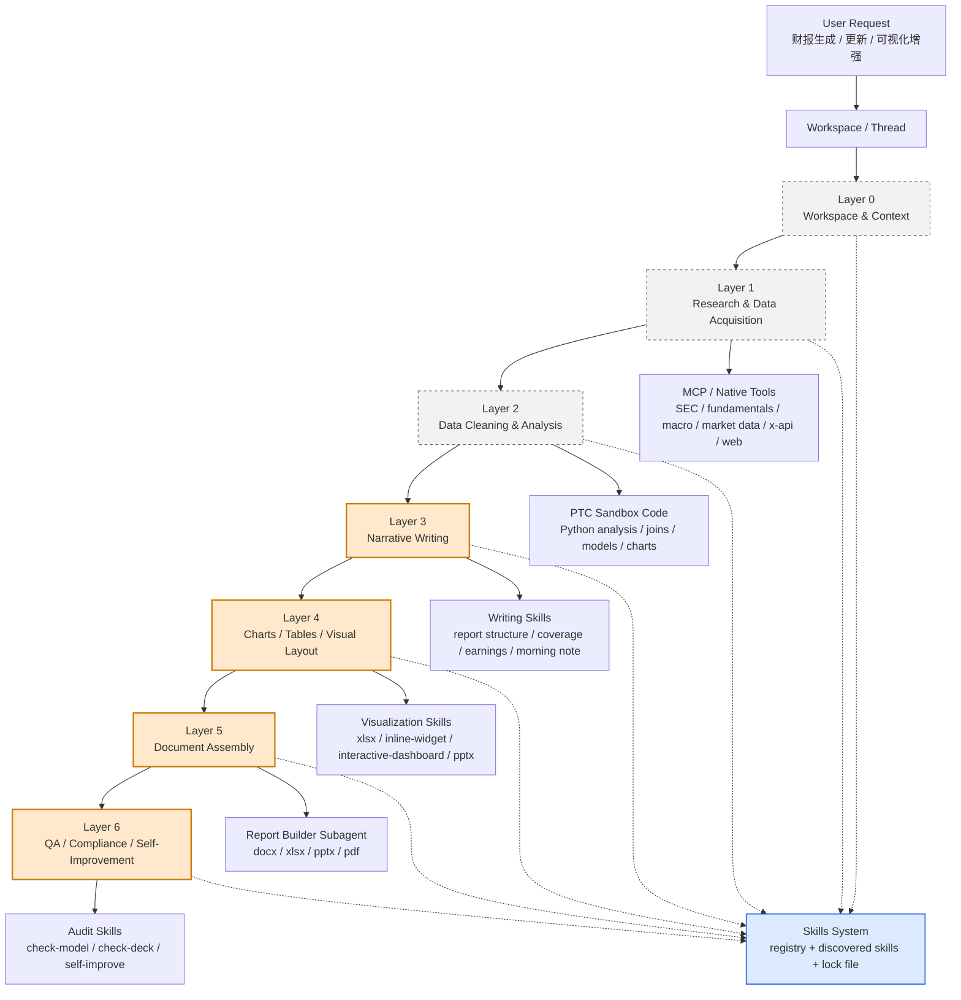
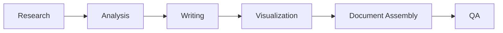
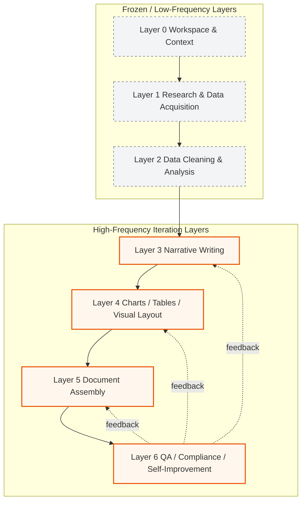
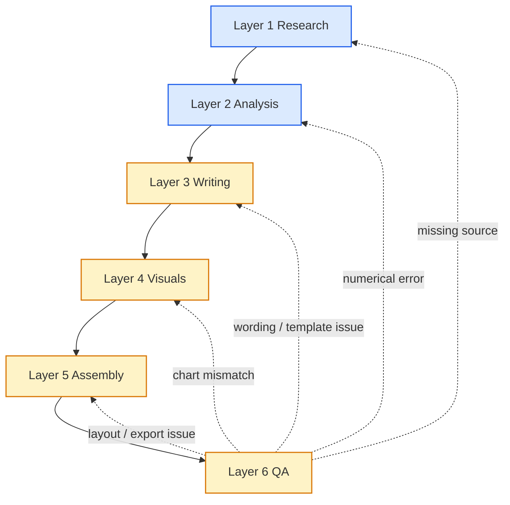

# LangAlpha 财报生成管线分层切分图

## 目标

本文档将 LangAlpha 的真实框架映射到“金融财报生成”任务，给出一个可操作的层级切分：

- 整个财报生成管线如何分层
- 每一层的输入 / 输出是什么
- 运行方式如何组织
- 每层主要关联哪些 skill
- 如果我们的重点是“强化金融可视化”，应该优先作用在哪些层

本文暂不设计测评标准，只讨论系统结构与迭代边界。

---

## 一、总览图

---

## 二、层级定义

### Layer 0: Workspace & Context

这一层对应 LangAlpha 的基础运行单元，而不是某个 skill。

#### 输入

- 用户请求
- workspace 历史文件
- `agent.md`
- 长期 memory
- memo 文档
- 用户画像
- thread 历史

#### 输出

- 当前任务上下文
- 工作区工作目录
- 已持久化的研究资产

#### 运行方式

- 由 workspace / thread 机制承载
- 每个研究目标对应一个长期 workspace
- 后续所有步骤都在同一 sandbox 与文件系统下持续累积

#### LangAlpha 对应实现

- `agent.md` 持久化
- `.agents/user/memory/`
- `.agents/workspace/memory/`
- `.agents/user/memo/`
- `WorkspaceManager`
- `PTCSandbox`

#### 关联 skill

- `user-profile`
- `secretary`
- `self-improve`

#### 说明

这一层不是财报生成内容本身，但它决定：

- 财报是否能迭代
- 前一版分析是否能被继承
- 专家反馈是否能沉淀

如果没有这一层，后面的 skill iteration 会退化成一次性 prompt。

---

### Layer 1: Research & Data Acquisition

这一层负责把原始金融信息收集进来。

#### 输入

- 公司 / ticker
- 时间范围
- 研究主题
- 外部新闻 / 社媒 / SEC / macro / market data

#### 输出

- 原始材料集合
- 引用来源列表
- 初步结构化数据

#### 运行方式

- 先用 native tools 做快速检索
- 再用 MCP server 做批量抓取 / 结构化提取
- 必要时用 web search / crawl / x-api 补充
- 大量数据通过 PTC sandbox 里的 Python 代码做归档

#### LangAlpha 对应实现

- native financial tools
- `price_data` / `fundamentals` / `macro` / `options`
- `yf_*` 系列 MCP
- `sec` 工具
- `web_search`
- `web_fetch`
- `scrapling`
- `x-api`

#### 关联 skill

- `morning-note`
- `catalyst-calendar`
- `sector-overview`
- `competitive-analysis`
- `earnings-preview`
- `initiating-coverage`
- `web-scraping`
- `x-api`

#### 说明

这一层的目标不是写报告，而是建立“可追溯证据池”。

---

### Layer 2: Data Cleaning & Analysis

这一层负责把原始信息变成可计算、可解释的金融分析结果。

#### 输入

- 原始财务报表
- 拉取的数据表
- 历史价格序列
- macro 数据
- 同业对比数据
- 社媒 / 新闻信号

#### 输出

- 清洗后的结构化表
- 比率 / 增长 / 估值指标
- 财务模型中间结果
- 趋势图 / 对比图的底层数据

#### 运行方式

- 主要在 PTC sandbox 中通过 Python 处理
- 通过 `execute_code` 写入脚本并执行
- 利用 MCP wrappers 获取大批量数据
- 将中间结果保存到 workspace 文件系统

#### LangAlpha 对应实现

- `execute_code`
- `finance` / `fundamentals` / `macro`
- sandbox Python
- `work/<task>/`
- `results/`

#### 关联 skill

- `dcf-model`
- `comps-analysis`
- `3-statements`
- `model-update`
- `check-model`
- `earnings-analysis`
- `thesis-tracker`

#### 说明

这层是财报生成的“数值底座”。  
如果这一层有问题，后面的写作和图表再好看也没意义。

---

### Layer 3: Narrative Writing

这一层负责把分析结果组织成专业财报语言。

#### 输入

- Layer 2 的分析结果
- 目标报告类型
- 语言风格要求
- 覆盖范围
- 风险偏好与结论框架

#### 输出

- 分章节的正文草稿
- 投资逻辑
- 结论
- 风险提示
- 叙述口径

#### 运行方式

- 主要由 LLM 直接生成
- 但会受到 skill 文档的流程约束
- 需要引用 Layer 2 输出的结构化结论，而不是重新猜数据

#### LangAlpha 对应实现

- `initiating-coverage`
- `earnings-analysis`
- `earnings-preview`
- `morning-note`
- `sector-overview`
- `competitive-analysis`

#### 说明

这层的核心不是“写得多”，而是：

- 叙述是否符合财报语体
- 结论是否建立在 Layer 2 的分析之上
- 风险陈述是否完整

如果我们要做 skill iteration，写作层是一个重要的优化对象。

---

### Layer 4: Charts / Tables / Visual Layout

这一层负责把分析和正文转成可视化资产。

#### 输入

- Layer 2 的表格 / 指标 / 时间序列
- Layer 3 的叙述结构
- 输出介质要求

#### 输出

- 图表
- 表格
- dashboard
- 嵌入式可视化
- 版面布局

#### 运行方式

- 可以在 sandbox 中生成图表文件
- 可以通过 inline widget 直接渲染
- 可以做 interactive dashboard
- 可以嵌入 xlsx / docx / pptx / pdf

#### LangAlpha 对应实现

- `inline-widget`
- `interactive-dashboard`
- `xlsx`
- `pptx`
- `docx`
- `pdf`

#### 说明

这是我们后续重点要强化的层。

它的任务不是单纯“画图”，而是：

- 把分析结果正确地视觉化
- 确保图表和正文口径一致
- 提高读者对财报的理解效率

---

### Layer 5: Document Assembly

这一层负责把内容装配成最终交付物。

#### 输入

- 正文草稿
- 图表
- 表格
- 附录
- 版式要求

#### 输出

- DOCX 报告
- XLSX 模型
- PPTX deck
- PDF 成品

#### 运行方式

- 由 `report-builder` subagent 主导
- 它会优先加载格式 skill
- 再根据目标输出格式生成最终文档

#### LangAlpha 对应实现

- `report-builder` subagent
- `docx`
- `xlsx`
- `pptx`
- `pdf`

#### 说明

这一层是“交付层”，和分析层应该分开。

如果我们想提升图表质量，实际会同时影响：

- Layer 4 的图表生成
- Layer 5 的嵌入与排版

---

### Layer 6: QA / Compliance / Self-Improvement

这一层负责把错误拦在交付前。

#### 输入

- 最终草稿
- 图表
- 模型文件
- 引用清单
- 专家批注

#### 输出

- 修订建议
- 错误清单
- 回滚点
- 自我改进任务

#### 运行方式

- 通过 audit skill 或独立审查流程执行
- 发现问题后回流到上游层修正

#### LangAlpha 对应实现

- `check-model`
- `check-deck`
- `self-improve`

#### 说明

这一层不产生主要内容，但决定最终可用性。

---

## 三、这些层和 LangAlpha 的真实运行关系

LangAlpha 不是严格的单向流水线，而是一个“分层但可回跳”的结构。

### 主路径

### 回跳路径

- QA 发现数字错误，回到 Analysis
- QA 发现图表口径错，回到 Visualization / Analysis
- Writing 发现证据不足，回到 Research
- Document Assembly 发现版式不适配，回到 Visualization / Writing

### LangAlpha 的支撑方式

- workspace 文件保留中间产物
- subagent 可分工执行
- steering 可在执行中修正方向
- skills 可按需加载
- report-builder 可以专注交付

---

## 四、我们要做的“专家迭代”机制，应该插在哪里

如果把后续 skill iteration 也放进这个结构，最自然的落点是：

### 1. 专家反馈主要回流到 Layer 3 和 Layer 4

因为这两层是最容易从“专业差异”中受益的地方。

#### 回流到 Layer 3 的反馈

- 叙述不专业
- 逻辑跳跃
- 结论太弱 / 太强
- 风险提示缺失
- 章节结构不符合金融写作规范

#### 回流到 Layer 4 的反馈

- 图表选择不合适
- 图表和正文不一致
- 图表标题 / 轴 / 单位错误
- 视觉布局不利于阅读
- 关键信号没有被图表突出

### 2. 上游层尽量稳定

我们可以把 Layer 1 / Layer 2 尽量冻结为“稳定能力层”：

- Research 继续按固定数据源和抓取规范跑
- Analysis 继续按固定口径跑

然后把主要迭代压力放到：

- Writing skill
- Visualization skill
- Report assembly skill

这正适合你前面说的“强化金融可视化能力”的目标。

---

## 五、针对金融可视化的定向优化边界

如果目标是强化可视化，建议优先作用在以下层：

### 优先级 1：Layer 4

这是最直接的优化对象。

可以迭代的 skill：

- `inline-widget`
- `interactive-dashboard`
- `xlsx`
- `pptx`

优化方向：

- 图表类型选择
- 图表与数据口径对齐
- 图表叙述和布局联动
- 图表在报告中的嵌入规范

### 优先级 2：Layer 5

这是可视化落到最终交付的地方。

可以迭代的 skill：

- `report-builder`
- `docx`
- `pptx`
- `pdf`

优化方向：

- 图表插入位置
- 图表说明文字
- 图表与正文交叉引用
- 页面布局与留白

### 优先级 3：Layer 3

写作层的叙述会决定图表是否“被用对”。

可以迭代的 skill：

- `initiating-coverage`
- `earnings-analysis`
- `earnings-preview`

优化方向：

- 在正文中提前埋设图表语义
- 明确每张图想解决的问题
- 让写作结构自然承接图表

### 不建议优先动的层

#### Layer 1 / Layer 2

原因不是不能动，而是：

- 它们更接近事实与数值底座
- 频繁改动会污染整个系统
- 你要的目标是“图表更好”，不是“数据抓取频繁变动”

所以这两层适合冻结或低频更新。

---

## 六、推荐的迭代边界图

---

## 七、结论

如果结合 LangAlpha 的真实框架来做财报生成，最合理的层级切分不是“一个总技能”，而是：

1. Workspace / context 层
2. Research / acquisition 层
3. Analysis 层
4. Writing 层
5. Visualization 层
6. Assembly 层
7. QA / self-improvement 层

对于你现在的目标，最重要的操作判断是：

- **上游研究与分析尽量稳定**
- **中下游写作、图表、装配重点迭代**
- **专家反馈主要回流到写作和可视化层**

这会最大化利用 LangAlpha 的现有架构，同时给后面的专家迭代机制留出清晰边界。

---

## 八、benchmark rubric 到七层管线的映射

这一节把上一份调研中的 benchmark / rubric 直接映射回 LangAlpha 的七层财报管线，回答两个问题：

1. 每一层应该怎么打标
2. 每一层的错误应该如何回流到上游

### 1. Layer 0: Workspace & Context

#### 对应 rubric

- 不直接对应具体 benchmark 的主 rubric
- 但会影响所有下游层的稳定性

#### 打标方式

- workspace 是否复用了正确历史上下文
- `agent.md` 是否保留了关键研究决策
- memo / memory 是否被正确读取

#### 回流方式

- 如果 workspace 断档，补写 `agent.md`
- 如果记忆缺失，补充 memos / notes 结构

#### 适配的 benchmark 思路

- 间接吸收 `Fin-RATE` 的 longitudinal tracking 视角
- 吸收 `FinLFQA` 的 evidence continuity 视角

---

### 2. Layer 1: Research & Data Acquisition

#### 对应 rubric

- `Fin-RATE` 的 retrieval vs reasoning 区分
- `BizFinBench` 的 information extraction 维度
- `FinLFQA` 的 evidence support

#### 打标方式

- 来源是否齐全
- 是否抓到了正确 filing / transcript / news / market data
- 是否遗漏关键数据源
- 是否把时间窗 / 公司 / 事件抓错

#### 回流方式

- 发现缺源则回补检索 skill
- 发现错源则修正 source selection rule
- 发现遗漏则补检索 checklist

#### 最适合的反馈类型

- missing source
- wrong source
- insufficient evidence
- context misunderstanding

---

### 3. Layer 2: Data Cleaning & Analysis

#### 对应 rubric

- `FinVerBench` 的 arithmetic / linkage / YoY / magnitude perturbation
- `BizFinBench` 的 numerical calculation / reasoning
- `Fin-RATE` 的 reasoning error attribution

#### 打标方式

- 数字是否算对
- 跨表是否一致
- 同比 / 环比 / 绝对值是否正确
- 是否有单位、口径、四舍五入错误

#### 回流方式

- 修改分析脚本
- 修改口径规则
- 增加数值校验脚本
- 增加 cross-statement check

#### 最适合的反馈类型

- numerical error
- cross-statement inconsistency
- year-over-year error
- magnitude error
- unit mismatch

#### 说明

这一层应该尽量低频迭代。  
因为它更接近事实底座，动得太频繁会污染后续写作和图表层。

---

### 4. Layer 3: Narrative Writing

#### 对应 rubric

- `Template-Based Financial Report Generation` 的 coverage / section completion / template adherence
- `FinLFQA` 的 attribution quality / answer quality
- `BizFinBench` 的 subjective judgment 维度

#### 打标方式

- 章节是否完整
- 逻辑是否顺
- 结论是否与证据一致
- 表述是否专业
- 是否有过度推断

#### 回流方式

- 更新 `initiating-coverage`、`earnings-analysis`、`earnings-preview` 等写作型 skill
- 增加章节模板
- 增加反例
- 增加正文中证据引用规则

#### 最适合的反馈类型

- template violation
- narrative gap
- over-claim
- missing evidence
- wording issue

#### 说明

这一层是“专家标注 -> skill patch”最适合落地的地方之一。

---

### 5. Layer 4: Charts / Tables / Visual Layout

#### 对应 rubric

- `FinChart-Bench` 的 chart comprehension 视角
- `Chart2Code` 的 reproduction / editing / long-table to chart
- `FinVerBench` 的可视化一致性思路

#### 打标方式

- 图表是否表达了正确数据关系
- 图表类型是否合适
- 轴、单位、标签是否正确
- 图表是否和正文一致
- 图表是否足够清晰、可读

#### 回流方式

- 调整图表模板
- 调整图表选择规则
- 调整 xlsx / pptx / inline-widget / interactive-dashboard 的输出规范
- 调整图表标题、caption、单位、颜色、排序规则

#### 最适合的反馈类型

- chart mismatch
- visual fidelity issue
- chart design issue
- label / unit error
- layout issue
- chart-text inconsistency

#### 说明

如果我们的目标是强化金融可视化，这一层是最高优先级迭代对象。

---

### 6. Layer 5: Document Assembly

#### 对应 rubric

- `Template-Based Financial Report Generation` 的 template adherence
- `BizFinBench` 的 subjective + objective 综合判断
- `Chart2Code` 的最终交付视觉一致性

#### 打标方式

- 图表是否插入正确位置
- 表格和正文是否排版合理
- 文档结构是否符合目标报告类型
- 输出格式是否满足交付要求

#### 回流方式

- 修改 report-builder 的装配顺序
- 修改 docx / pptx / pdf / xlsx 输出脚本
- 修改章节与插图的绑定规则

#### 最适合的反馈类型

- ordering issue
- layout issue
- section mismatch
- formatting error
- export issue

#### 说明

这一层通常不改分析本身，但会显著影响最终专业感。

---

### 7. Layer 6: QA / Compliance / Self-Improvement

#### 对应 rubric

- `FinVerBench` 的 verification / calibration
- `FinLFQA` 的 attribution quality
- `Fin-RATE` 的 error attribution

#### 打标方式

- 是否有事实错误
- 是否有数字错误
- 是否有引用缺失
- 是否有过度结论
- 是否有合规风险

#### 回流方式

- 错误分类后回写到对应上游层
- 触发 `check-model`、`check-deck`、`self-improve`
- 对 recurring errors 生成 skill patch issue

#### 最适合的反馈类型

- factual error
- numerical error
- missing citation
- compliance issue
- contradiction handling

#### 说明

这一层是整个闭环的出口和回流点。  
它既负责拦截，也负责把专家反馈结构化地送回上游。

---

## 九、七层管线的回流逻辑总图

---

## 十、落地建议

如果后续我们真的要把 benchmark rubric 用到 LangAlpha 的专家迭代里，建议先按下面的顺序接入：

1. 先把 Layer 2、Layer 6 的错误类型固定下来，因为它们最容易自动化。
2. 再把 Layer 4 的视觉类反馈固定下来，因为这正是你当前最关注的方向。
3. 最后统一 Layer 3 的写作类反馈，因为它和专家主观判断最相关。

这样会形成一个从“事实”到“叙述”再到“可视化”的稳定回流路径。
