# HTML Sample Expansion Runbook

This runbook describes the repeatable pipeline for expanding local/offline HTML verifier
samples before large production runs.

Terminology note: older files may say "V2"; in this repository that means the
candidate-only/no-reference verifier variant, not a semantic version number.

## Goal

Build a clean, localized, auditable HTML development set for the verifier. The target
mix after expansion is close to 1:1 Chinese/English when enough admissible Chinese HTML
sources are available.

The expanded set is a development set first. Only stable, reviewed samples should later
be promoted into the long-lived golden manifest.

Current status: broad public-HTML crawling is paused. User review found that even strict
public crawl outputs often remain web-display/navigation pages rather than
financial-report-like documents. Use the retained functional samples for verifier
regression, and prioritize verifier optimization for model-generated HTML reports.

## Pipeline

```mermaid
flowchart LR
  A["source configs"] --> B["discover_html_strategy_pages.py"]
  B --> C["html_strategy_candidates.jsonl"]
  C --> D["build_html_localization_manifest.py"]
  D --> E["localize_strategy_html.py"]
  E --> F["localized index.html + resource_manifest.json"]
  F --> G["audit_html_candidate_set.py"]
  G --> H["html_production_manifest.csv"]
  H --> I["run_html_batch.py with html_skill_iteration"]
```



## 1. Discover report-like HTML candidates

Use existing source configs first:

```powershell
.\.venv\Scripts\python.exe dataset_tools/strategy_reports/discover_html_strategy_pages.py `
  --config dataset_tools/strategy_reports/sources.expanded.json `
  --config dataset_tools/strategy_reports/sources.china.json `
  --out-dir dataset_build/html_discovery `
  --max-candidates-per-source 20 `
  --reset
```

Outputs:

- `dataset_build/html_discovery/html_strategy_candidates.jsonl`
- `dataset_build/html_discovery/html_strategy_discovery_summary.json`

The discovery step is intentionally permissive. Candidates are not admitted samples.

## 2. Build a balanced localization manifest

```powershell
.\.venv\Scripts\python.exe dataset_tools/strategy_reports/build_html_localization_manifest.py `
  --candidates dataset_build/html_discovery/html_strategy_candidates.jsonl `
  --out evals/strategy_report/html_localization_candidates.generated.json `
  --per-language 15 `
  --min-score 4 `
  --max-per-institution 5 `
  --enabled
```

`--per-language 15` targets 15 Chinese and 15 English candidates. If one language has
fewer candidates, the output will preserve what is available and report language counts.

## 3. Localize candidates

The existing localizer can consume the generated manifest:

```powershell
.\.venv\Scripts\python.exe evals/strategy_report/localize_strategy_html.py `
  --manifest evals/strategy_report/html_localization_candidates.generated.json `
  --out-dir dataset_build/html_candidates_localized `
  --max-samples 30
```

If Chrome/Chromium is non-standard:

```powershell
.\.venv\Scripts\python.exe evals/strategy_report/localize_strategy_html.py `
  --manifest evals/strategy_report/html_localization_candidates.generated.json `
  --out-dir dataset_build/html_candidates_localized `
  --chrome-path C:\path\to\chrome.exe
```

## 4. Audit and admit localized samples

```powershell
.\.venv\Scripts\python.exe dataset_tools/strategy_reports/audit_html_candidate_set.py `
  --localized-dir dataset_build/html_candidates_localized `
  --localization-summary dataset_build/html_candidates_localized/localization_summary.json `
  --out-dir dataset_build/html_candidate_audit `
  --per-language 15
```

Outputs:

- `dataset_build/html_candidate_audit/html_candidate_audit.json`
- `dataset_build/html_candidate_audit/html_candidate_audit.csv`
- `dataset_build/html_candidate_audit/html_production_manifest.csv`
- `dataset_build/html_candidate_audit/summary.json`

The admitted manifest is the entry point for verifier batch runs.

Optional runtime audit:

```powershell
.\.venv\Scripts\python.exe dataset_tools/strategy_reports/audit_html_candidate_set.py `
  --localized-dir dataset_build/html_candidates_localized `
  --out-dir dataset_build/html_candidate_audit `
  --runtime
```

Runtime audit is slower because it launches Chrome and the HTML runtime adapter.

## 5. Run verifier baseline

```powershell
.\.venv\Scripts\python.exe evals/strategy_report/run_html_batch.py `
  --manifest dataset_build/html_candidate_audit/html_production_manifest.csv `
  --out-dir evals/strategy_report/results/html_prod_baseline `
  --verifier-profile html_skill_iteration `
  --resume
```

Review:

- score distribution by language;
- gate pass/fail by language;
- text extraction length;
- visual count and skipped visual count;
- generated `<sample_id>.skill_feedback.md` files.

## Chinese/English balance policy

The target is close to 1:1 Chinese/English after expansion. Do not admit low-quality
HTML pages merely to satisfy the ratio.

Practical guidance:

- English official HTML strategy pages are usually easier to localize.
- Chinese strategy research is often distributed as PDF or behind portals. Good Chinese
  HTML may require official article pages, public research mirrors, or controlled
  generated HTML samples.
- If admitted Chinese HTML remains scarce, keep the manifest honest and record the
  shortfall in `summary.json`; then add Chinese HTML sources or generated skill outputs
  in a separate pass.

## Admission defaults

A localized candidate is admitted when:

- `index.html` exists;
- text length is at least 2200 characters;
- article-quality detection passes;
- the selected article container has enough long paragraphs and strategy-report signals;
- link density is low enough to rule out navigation/index pages;
- critical failed resources are 0;
- remote resource references are 0;
- local referenced resources exist;
- runtime audit passes, if `--runtime` is enabled.

These defaults are intentionally strict for production-style offline HTML testing.

Hard rejects include:

- landing/index/navigation-heavy pages;
- generic insight/research/publication homepages;
- podcast/video/webcast/profile pages;
- blank shell pages;
- pages with weak strategy-report signals;
- pages with implausibly large aggregate text.
