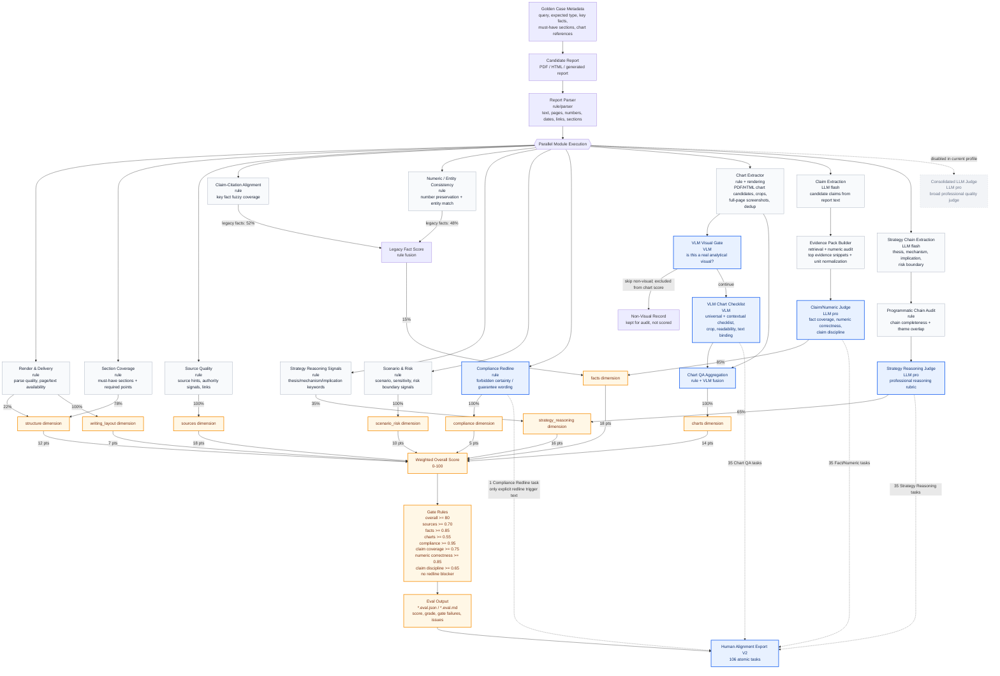

# Latest Strategy Report Verifier Flowchart

Updated: 2026-06-16

This diagram reflects the current `full_best_effort` verifier profile used by:

```text
evals/strategy_report/results/full_eval_p2clean_20260615_chart4_pdf21/
```

Legend:

- Blue nodes are covered by the current human-alignment export.
- Gray nodes are active verifier modules but not included in the current alignment experiment.
- Edge labels show the current scoring/fusion weights where applicable.



## Current Scoring Details

### Overall Dimension Weights

| Dimension | Weight |
|---|---:|
| structure | 12 |
| sources | 18 |
| facts | 18 |
| strategy_reasoning | 16 |
| scenario_risk | 10 |
| charts | 14 |
| writing_layout | 7 |
| compliance | 5 |

### Dimension Construction

| Dimension | Current construction |
|---|---|
| structure | `0.78 * section_coverage + 0.22 * render_delivery` |
| sources | `source_quality`; consolidated LLM source score is disabled |
| facts | `0.15 * legacy_fact_rules + 0.85 * claim_numeric_llm` |
| legacy_fact_rules | `0.52 * claim_citation_alignment + 0.48 * numeric_entity_consistency` |
| strategy_reasoning | `0.35 * strategy_reasoning_rule + 0.65 * strategy_reasoning_llm` |
| scenario_risk | `scenario_risk`; consolidated LLM scenario score is disabled |
| charts | `chart_qa`; chart VLM judge is enabled inside this module |
| writing_layout | `render_delivery`; consolidated LLM layout score is disabled |
| compliance | `compliance_redline`; consolidated LLM compliance score is disabled |

### Chart QA Internal Weights

Report-level chart score:

| Chart component | Weight |
|---|---:|
| inventory | 0.15 |
| spec_completeness | 0.15 |
| data_faithfulness | 0.25 |
| chart_text_alignment | 0.20 |
| visual_clarity | 0.15 |
| financial_appropriateness | 0.10 |

Chart-level rule/VLM fusion:

| Subscore | Rule/VLM fusion |
|---|---|
| spec_completeness | `0.35 * rule + 0.65 * VLM metadata completeness` |
| data_faithfulness | `0.30 * rule + 0.70 * VLM data faithfulness` |
| chart_text_alignment | `0.50 * rule + 0.50 * VLM alignment/claim support` |
| visual_clarity | `0.50 * rule + 0.50 * VLM crop/readability/professionalism` |
| financial_appropriateness | `0.45 * rule + 0.55 * VLM suitability/usefulness/appropriateness` |

### Claim/Numeric LLM Internal Weights

| Subscore | Weight |
|---|---:|
| claim_coverage | 0.42 |
| numeric_correctness | 0.40 |
| claim_discipline | 0.18 |

The evidence retrieval pre-score uses:

| Signal | Weight |
|---|---:|
| token_overlap | 0.46 |
| number_similarity | 0.34 |
| hint_overlap | 0.12 |
| date_similarity | 0.08 |

### Strategy Reasoning LLM Internal Weights

| Subscore | Weight |
|---|---:|
| thesis_clarity | 0.15 |
| mechanism_depth | 0.20 |
| evidence_to_conclusion | 0.18 |
| investment_implication | 0.17 |
| scenario_risk_boundary | 0.13 |
| overclaim_control | 0.07 |
| theme_alignment | 0.10 |

## Current Human Alignment Coverage

Current export:

```text
evals/strategy_report/alignment_exports/pdf21_alignment_v2/
```

Covered by the current alignment experiment:

- Chart QA / VLM judgement: 35 atomic tasks.
- Claim/Numeric fact judgement: 35 atomic tasks.
- Strategy Reasoning chain judgement: 35 atomic tasks.
- Compliance Redline: 1 atomic task, only explicit redline trigger text.

Not covered in this round:

- Section coverage and generic rule-hit tasks, because they require broad report-level context.
- Overclaim / claim discipline standalone tasks, because current saved context is too short for expert review.
- Source quality and strict claim-citation audit, because full professional evidence verification is out of current scope.
- Consolidated LLM judge, because it is disabled in the current verifier profile.
