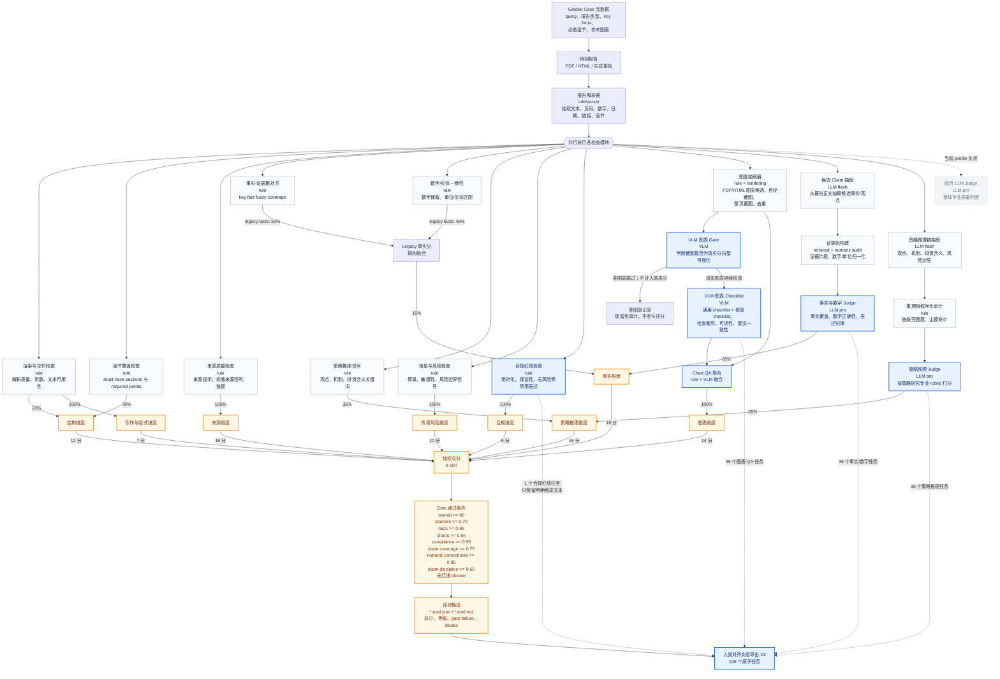

# 最新版策略报告 Verifier 流程图

更新时间：2026-06-16

本文对应当前全量测试使用的 `full_best_effort` verifier profile：

```text
evals/strategy_report/results/full_eval_p2clean_20260615_chart4_pdf21/
```

图例：

- 蓝色节点：本次人类对齐实验正在验证的环节。
- 灰色节点：当前 verifier 中启用，但本轮对齐实验暂不验证的环节。
- 虚线节点：当前 profile 中关闭的可选模块。
- 边上的百分比或分值：当前分数融合权重。



## 总体评分权重

| 维度 | 权重 |
|---|---:|
| 结构完整性 `structure` | 12 |
| 来源质量 `sources` | 18 |
| 事实与数字 `facts` | 18 |
| 策略推理 `strategy_reasoning` | 16 |
| 情景与风险 `scenario_risk` | 10 |
| 图表质量 `charts` | 14 |
| 写作与版式 `writing_layout` | 7 |
| 合规 `compliance` | 5 |

## 各维度如何构成

| 维度 | 当前构成方式 |
|---|---|
| 结构完整性 | `0.78 * 章节覆盖 + 0.22 * 渲染与交付` |
| 来源质量 | `source_quality`，当前综合 LLM 来源判断关闭 |
| 事实与数字 | `0.15 * legacy fact rules + 0.85 * Claim/Numeric LLM` |
| legacy fact rules | `0.52 * 事实-证据粗对齐 + 0.48 * 数字/实体一致性` |
| 策略推理 | `0.35 * 规则策略信号 + 0.65 * Strategy Reasoning LLM` |
| 情景与风险 | `scenario_risk`，当前综合 LLM 情景判断关闭 |
| 图表质量 | `chart_qa`，内部启用 VLM gate 和 checklist |
| 写作与版式 | `render_delivery`，当前综合 LLM 版式判断关闭 |
| 合规 | `compliance_redline`，当前综合 LLM 合规判断关闭 |

## Chart QA 内部权重

报告级图表分：

| 图表子项 | 权重 |
|---|---:|
| 图表覆盖/库存 `inventory` | 0.15 |
| 规格完整性 `spec_completeness` | 0.15 |
| 数据可信度 `data_faithfulness` | 0.25 |
| 图文一致性 `chart_text_alignment` | 0.20 |
| 视觉清晰度 `visual_clarity` | 0.15 |
| 金融专业适配度 `financial_appropriateness` | 0.10 |

图表级 rule/VLM 融合：

| 子分 | 融合方式 |
|---|---|
| 规格完整性 | `0.35 * rule + 0.65 * VLM metadata completeness` |
| 数据可信度 | `0.30 * rule + 0.70 * VLM data faithfulness` |
| 图文一致性 | `0.50 * rule + 0.50 * VLM alignment/claim support` |
| 视觉清晰度 | `0.50 * rule + 0.50 * VLM crop/readability/professionalism` |
| 金融专业适配度 | `0.45 * rule + 0.55 * VLM suitability/usefulness/appropriateness` |

## Claim/Numeric LLM 内部权重

| 子分 | 权重 |
|---|---:|
| 事实覆盖 `claim_coverage` | 0.42 |
| 数字正确性 `numeric_correctness` | 0.40 |
| 表述纪律 `claim_discipline` | 0.18 |

证据包检索预评分使用：

| 信号 | 权重 |
|---|---:|
| 文本重合 `token_overlap` | 0.46 |
| 数字相似 `number_similarity` | 0.34 |
| 提示词重合 `hint_overlap` | 0.12 |
| 日期相似 `date_similarity` | 0.08 |

## Strategy Reasoning LLM 内部权重

| 子分 | 权重 |
|---|---:|
| 观点清晰度 `thesis_clarity` | 0.15 |
| 机制深度 `mechanism_depth` | 0.20 |
| 证据到结论 `evidence_to_conclusion` | 0.18 |
| 投资含义 `investment_implication` | 0.17 |
| 情景/风险边界 `scenario_risk_boundary` | 0.13 |
| 过度宣称控制 `overclaim_control` | 0.07 |
| 主题一致性 `theme_alignment` | 0.10 |

## 本次人类对齐实验覆盖范围

当前导出位置：

```text
evals/strategy_report/alignment_exports/pdf21_alignment_v2/
```

本轮会验证：

- 图表 QA / VLM 判断：35 个原子任务。
- 事实与数字核查：35 个原子任务。
- 策略推理链判断：35 个原子任务。
- 合规红线：1 个原子任务，仅保留明确触发红线的文本段。

本轮暂不验证：

- 章节覆盖、规则命中类任务：需要太多报告级上下文，不适合拆成原子任务。
- 过度宣称独立任务：当前保存的上下文不足，容易让专家被迫猜测。
- 来源质量与严格证据核验：完整 source audit 暂不属于本阶段目标。
- 综合 LLM Judge：当前 profile 中未启用。
