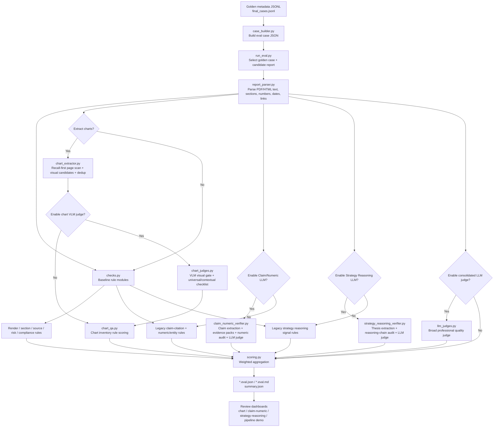

# Strategy Report Verifier Pipeline Overview

Updated: 2026-06-11

本文档说明当前策略报告 verifier 的整体结构、各检测模块、图表/VLM checklist 子流程，以及使用和维护时需要注意的关键点。代码入口主要位于：

```text
evals/strategy_report/
```

当前 canonical golden sample set 位于：

```text
dataset_build/golden_samples_merged_cn10_no_landscape/final_cases.jsonl
```

## 1. 总体目标

Verifier 的目标是用自动化流程近似替代人工评审，对“生成出来的策略报告”进行质量量化。当前开发阶段还没有完整的报告生成管线，因此默认用 golden sample 的原始公开报告作为 candidate report 做 calibration；后续只需要把 `--candidate-report` 指向生成报告，就可以在同一组 golden cases 上做评估。

当前 verifier 关注八个总维度：

| Dimension | 权重 | 主要含义 |
|---|---:|---|
| `structure` | 12 | 报告结构、章节覆盖、交付可解析性 |
| `sources` | 18 | 来源充分性、权威性、可追溯性 |
| `facts` | 18 | key facts、数字、实体的一致性 |
| `strategy_reasoning` | 16 | 策略观点、因果机制、投资含义 |
| `scenario_risk` | 10 | 情景、风险、边界条件 |
| `charts` | 14 | 图表抽取、可视化质量、文本一致性 |
| `writing_layout` | 7 | 可读性、版式、交付完整性 |
| `compliance` | 5 | 合规红线、免责声明、禁止性表述 |

总分由 `scoring.py` 聚合，并输出：

- `*.eval.json`：完整机器可读结果
- `*.eval.md`：简版人类可读摘要
- `summary.json`：批量结果摘要
- 图表看板：由 `build_chart_dashboard.py` 生成

## 2. 整体流程图



## 3. 输入与 Case 构建

### 3.1 Golden Metadata

Golden metadata 来自前面的 meta extraction 流程，包含：

- `case_id`
- `candidate_query`
- `expected_report_type`
- `source_pdf`
- `key_facts`
- `must_have_sections`
- `prohibited_mistakes`
- `charts_and_tables_to_learn_from`
- `evaluation_hooks`

当前推荐输入：

```text
dataset_build/golden_samples_merged_cn10_no_landscape/final_cases.jsonl
```

### 3.2 Case Builder

实现文件：

```text
evals/strategy_report/case_builder.py
```

功能：

1. 读取 golden metadata JSONL。
2. 将 metadata 转换为 verifier case JSON。
3. 写入 `evals/strategy_report/cases_merged33/*.json`。

常用命令：

```powershell
.\.venv\Scripts\python.exe evals/strategy_report/case_builder.py `
  --input dataset_build/golden_samples_merged_cn10_no_landscape/final_cases.jsonl `
  --out-dir evals/strategy_report/cases_merged33
```

## 4. Candidate Report 解析

实现文件：

```text
evals/strategy_report/report_parser.py
dataset_tools/strategy_reports/document_extractors.py
```

解析目标：

- PDF 文本、页数、标题、headings
- HTML 文本、标题、链接、表格/图片统计
- 数字、链接、来源提示、图表/表格提示
- 可选渲染截图

当前 calibration 模式：

- 如果没有传 `--candidate-report`，`run_eval.py` 会使用 case 中的原始公开报告作为 candidate。
- 后续生成管线接入后，传入生成报告即可复用同一 case。

注意事项：

- PDF/HTML 都被支持。
- 对中文 PDF，文本层可能出现编码问题；前面的 golden sample 清洗已经尽量筛掉问题样本。
- parser 会为后续 rule checks 提供统一字段，但它不是 OCR/证据核验系统，不能完全替代人工来源审查。

## 5. Rule-Based 检测模块

实现文件：

```text
evals/strategy_report/checks.py
```

`run_rule_checks()` 当前返回九个模块。

### 5.1 Render And Delivery

函数：

```text
render_delivery_check()
```

检查：

- candidate 是否能解析
- `parse_quality`
- 文本长度是否足够
- PDF 是否有页数和渲染图
- HTML 是否有标题、表格或图片

输出：

- `score`
- parse/layout issues
- parse quality metrics

### 5.2 Section Coverage

函数：

```text
section_coverage_check()
```

检查：

- golden metadata 中的 `must_have_sections`
- 标题或正文是否覆盖必要章节
- section 内的 required points 是否命中
- 通用策略报告结构覆盖度，例如摘要、证据、策略推理、情景、风险、附录/免责声明

注意：

- 当前主要依赖 fuzzy text matching。
- 对语义改写很强的报告可能偏严格，后续可用 LLM semantic checker 增强。

### 5.3 Source Quality

函数：

```text
source_quality_check()
```

检查：

- links 数量
- source pack 数量
- source hints
- 权威来源提示，例如监管、交易所、头部机构、新闻/数据源
- fact/view split 信号，例如 `we believe`、假设、测算等

注意：

- 这是“来源质量信号检查”，不是严格证据核验。
- 当前项目已明确暂不深挖专业级 evidence verification，以免过早拖慢开发。

### 5.4 Claim-Citation Alignment

函数：

```text
claim_citation_alignment_check()
```

检查：

- golden `key_facts` 是否在 candidate 文本中有足够 token overlap
- fact 中的重要数字是否保留
- 事实是否有基本支持迹象

注意：

- 当前是粗粒度 alignment，不追求逐句证据链精确验证。
- 后续可以用 LLM 或 retrieval 做更强语义对齐。

### 5.5 Numeric And Entity Consistency

函数：

```text
numeric_entity_consistency_check()
```

检查：

- key facts 中的数字是否出现在 candidate 中
- institution、report title、strategy subtype 等实体是否被保留

输出：

- numeric preservation score
- entity score
- `numerical_error` / `entity_mismatch` issues

### 5.6 Strategy Reasoning Rule Signals

函数：

```text
strategy_reasoning_rule_check()
```

检查：

- thesis / catalyst / implication / recommendation 等策略观点信号
- because / driven by / therefore / implication 等因果机制信号
- `evaluation_hooks.expected_themes` 命中情况

注意：

- 这是廉价规则信号，不等同于完整策略推理质量评估。
- 如果启用 consolidated LLM judge，`strategy_reasoning` 会与 LLM 分数融合。

### 5.7 Scenario And Risk

函数：

```text
scenario_risk_check()
```

检查：

- base/upside/downside/scenario/sensitivity 等情景信号
- risk/uncertainty/policy/market/execution 等风险信号
- prohibited mistakes 是否未被触犯

### 5.8 Chart QA

函数：

```text
chart_qa_check()
chart_qa_v2_check()
```

如果 `parsed.chart_inventory` 存在，进入 chart QA V2；否则使用旧版轻量规则。

图表模块是当前 verifier 的重点，详见第 7 节。

### 5.9 Compliance Redline

函数：

```text
compliance_redline_check()
```

检查：

- guaranteed return
- risk-free
- must buy
- sure profit
- 必涨、稳赚、保证收益、保本保收益等中文红线
- 免责声明或 important information 信号

如果触发 blocker，最终 grade/gate 会受到硬约束。

## 6. Optional Consolidated LLM Judge

实现文件：

```text
evals/strategy_report/llm_judges.py
```

用途：

- 用一个综合 LLM judge 补足规则检测的语义盲区
- 评估 professional reasoning、evidence support、chart usefulness、layout、compliance nuance

注意事项：

- 该模块会产生 LLM 成本。
- 开发时建议只在 1-2 个 case 上 smoke test。
- 当前图表专项已经有独立 VLM judge，consolidated LLM judge 不应替代图表 VLM checklist。

## 7. Chart QA / VLM Pipeline

图表 verifier 是当前最重要、迭代最活跃的模块。

相关文件：

```text
evals/strategy_report/chart_extractor.py
evals/strategy_report/chart_qa.py
evals/strategy_report/chart_judges.py
evals/strategy_report/build_chart_dashboard.py
evals/strategy_report/chart_vl_checklist_design.md
```

### 7.1 Chart Inventory Extraction

实现文件：

```text
chart_extractor.py
```

对 PDF：

1. 遍历前 `--chart-max-pages` 页。
2. 提取页面 text blocks。
3. 判断页面是否像 analytical chart page。
4. 检测 visual bbox。
5. 渲染目标 visual crop。
6. 渲染 full page screenshot。
7. 保存 page-level text、nearby text、text blocks、numbers、dates、title/source/unit hints。

对 HTML：

1. 解析 `figure/table/img/svg/canvas`。
2. 过滤明显无关节点。
3. 对 table/svg/canvas 生成 preview image。
4. 对 img 尝试保存本地或 data image asset。

每个 chart candidate 包含：

- `chart_id`
- `page`
- `bbox`
- `image_path`
- `page_image_path`
- `nearby_text`
- `page_text`
- `page_text_blocks`
- `source_note`
- `unit_hint`
- `numbers`
- `dates`
- `crop_quality`
- `object_index`
- `object_count_on_page`

### 7.2 Rule Layer Chart Scoring

实现文件：

```text
chart_qa.py
```

每张图表有五个 chart-level subscore：

| Subscore | 含义 |
|---|---|
| `spec_completeness` | 标题、单位、来源、日期等规格完整性 |
| `data_faithfulness` | 数字/单位/来源/expected match 的结构化信号 |
| `chart_text_alignment` | full page text 是否能解释当前 visual |
| `visual_clarity` | 截图尺寸、比例、可读性基础信号 |
| `financial_appropriateness` | 是否像金融策略报告中的分析型图表 |

报告级 chart QA 还包含：

- `inventory`
- `chart_count`
- `scorable_chart_count`
- `non_visual_skipped_count`
- `vl_judged_chart_count`
- hard threshold for data/text alignment

### 7.3 VLM Visual Gate

实现文件：

```text
chart_judges.py
chart_qa.py
```

VLM checklist 之前先执行 visual gate。

目的：

- 识别图表抽取器误检。
- 避免把目录页、封面、章节页、纯文字页、footer/sidebar/logo 当作图表评分。
- 节省 checklist token。

如果 VLM 判断目标截图不是分析型可视化，则返回：

```json
{
  "visual_gate": {
    "is_visualization": false,
    "visualization_kind": "not_visualization",
    "decision": "skip_checklist",
    "reason": "...",
    "confidence": 0.99
  },
  "is_analytical_visual": false,
  "universal_checklist": [],
  "contextual_checklist": []
}
```

聚合行为：

- 保留该截图和记录，方便人工确认过滤逻辑。
- 标记 `excluded_from_chart_score = true`。
- 写入 `skip_reason`。
- 计入 `non_visual_skipped_count`。
- 不参与报告级 chart score 均值。

### 7.4 VLM Checklist

如果 visual gate 判定为真实可视化，则进入 checklist。

VLM 输入：

- target visual screenshot
- full page screenshot
- nearby text
- full page text
- page text blocks
- rule hints: title/unit/source/numbers/dates/crop quality

VLM 输出两类 checklist：

1. `universal_checklist`
2. `contextual_checklist`

Universal checklist 固定 12 项：

| ID | 检查项 |
|---|---|
| U1 | Analytical purpose |
| U2 | Crop/render completeness |
| U3 | Title and analytical framing |
| U4 | Unit, scale, and time window |
| U5 | Source and methodology note |
| U6 | Readability |
| U7 | Chart type suitability |
| U8 | Visual professionalism |
| U9 | Text binding |
| U10 | Claim support |
| U11 | Risk of visual misdirection |
| U12 | Decision usefulness |

Contextual checklist 由 VLM 针对当前图表生成 2-5 条，例如：

- time-series 是否有清晰起止时间和趋势方向
- ranking/bar chart 是否有清晰排序和基准
- table 是否有表头、单位、关键行列
- multi-panel 是否能区分不同 panel 并匹配正确文字
- scenario chart 是否展示 base/upside/downside 假设

每条 checklist 都包含：

- `id`
- `label`
- `score`
- `status`
- `evidence`
- `severity_if_failed`

### 7.5 Chart VLM Aggregation

VLM 输出不会直接替代规则分，而是与规则层融合：

- 规则层负责结构化、低成本、可重复的检查。
- VLM 负责视觉完整性、可读性、图文语义对齐、专业性和误检判断。

当前融合逻辑：

- `spec_completeness` 融合 VLM metadata completeness。
- `chart_text_alignment` 融合 VLM alignment 和 claim support。
- `visual_clarity` 融合 crop completeness、readability、professionalism。
- `financial_appropriateness` 融合 chart type suitability、decision usefulness、financial appropriateness。
- high severity hard flags 会 cap 对应分数。

常见 hard flags：

- `decorative_visual`
- `incomplete_crop`
- `unreadable`
- `missing_critical_unit`
- `missing_critical_source`
- `text_contradiction`
- `misleading_scale`
- `wrong_chart_type`

### 7.6 Dashboard

实现文件：

```text
build_chart_dashboard.py
```

看板展示：

- target visual screenshot
- full page screenshot
- case id / grade / overall score
- chart module score
- crop quality
- VLM visual gate
- VLM universal checklist
- VLM case-specific checklist
- VLM subscores / hard flags
- nearby text
- full page text
- page text blocks
- raw VLM response

建议使用 `--embed-images` 生成自包含 HTML，避免 `file://` 或相对路径导致截图加载失败：

```powershell
.\.venv\Scripts\python.exe evals/strategy_report/build_chart_dashboard.py `
  --results-dir evals/strategy_report/results/chart_checklist_vlm_smoke4 `
  --out evals/strategy_report/results/chart_checklist_vlm_smoke4/index.html `
  --title "Chart VLM Checklist Smoke4" `
  --embed-images
```

## 8. Score Aggregation And Gate

实现文件：

```text
scoring.py
```

聚合方式：

1. 从 rule modules 得到 module scores。
2. 如果启用 LLM judge，则按维度融合规则分和 LLM 分。
3. 按固定权重计算 100 分总分。
4. 输出 grade 和 gate。

当前 gate fail 条件：

- overall score < 80
- redline issue present
- source quality < 70%
- numeric/fact checks < 85%
- compliance 不接近满分
- chart QA materially weak

注意：

- Gate 是自动化迭代信号，不应在 calibration 初期当作绝对质量裁决。
- 对 golden 原报告做 calibration 时，低分可能暴露 verifier 偏严或 extractor 误检，而不一定说明原报告差。

## 9. 当前已验证的 Smoke Case

最近一次 VLM checklist smoke：

```text
evals/strategy_report/results/chart_checklist_vlm_smoke4/
```

包含：

- `strategy_sample_001`：英文
- `strategy_sample_003`：英文
- `eastmoney_cn_strategy_005`：中文
- `eastmoney_cn_strategy_007`：中文

该 smoke 验证了：

- 目标截图和整页截图生成。
- VLM checklist 正常返回。
- visual gate 可以识别目录页、TOC、纯文字/大数字摘要页等非可视化误检。
- 被 visual gate 跳过的截图仍保留在看板中供人工确认。

## 10. 运行命令速查

构建当前 33 cases：

```powershell
.\.venv\Scripts\python.exe evals/strategy_report/case_builder.py `
  --input dataset_build/golden_samples_merged_cn10_no_landscape/final_cases.jsonl `
  --out-dir evals/strategy_report/cases_merged33
```

规则-only 单 case：

```powershell
.\.venv\Scripts\python.exe evals/strategy_report/run_eval.py `
  --case evals/strategy_report/cases_merged33/strategy_sample_001.json `
  --cases-dir evals/strategy_report/cases_merged33 `
  --render-pages 0 `
  --chart-max-pages 25 `
  --chart-max-charts 4 `
  --out-dir evals/strategy_report/results/rule_smoke
```

启用 chart VLM judge：

```powershell
.\.venv\Scripts\python.exe evals/strategy_report/run_eval.py `
  --case evals/strategy_report/cases_merged33/eastmoney_cn_strategy_005.json `
  --cases-dir evals/strategy_report/cases_merged33 `
  --render-pages 0 `
  --chart-max-pages 25 `
  --chart-max-charts 4 `
  --enable-chart-vl-judge `
  --chart-vl-max-charts 4 `
  --out-dir evals/strategy_report/results/chart_checklist_vlm_smoke
```

生成图表看板：

```powershell
.\.venv\Scripts\python.exe evals/strategy_report/build_chart_dashboard.py `
  --results-dir evals/strategy_report/results/chart_checklist_vlm_smoke `
  --out evals/strategy_report/results/chart_checklist_vlm_smoke/index.html `
  --embed-images
```

单元测试：

```powershell
.\.venv\Scripts\python.exe -m unittest evals.strategy_report.test_eval_units
```

## 11. 重点注意事项

### 11.1 LLM/VLM 成本控制

- 默认先跑 rule-only。
- 调 prompt 或 aggregation 时先跑 1-2 个 case。
- VLM 比文本 LLM 慢，批量跑前要确认截图逻辑没有明显问题。
- `chart_judges.py` 已有 chart-level cache；prompt/schema 重大变化时会通过 cache version 避免误用旧结果。

### 11.2 Visual Gate 不是删除器

Visual gate 跳过的是“评分”，不是“记录”：

- 截图保留。
- 看板保留。
- 作为 extractor false positive 供人工检查。
- 不拉低真实图表的 report-level chart score。

### 11.3 图表抽取仍需继续优化

当前 visual gate 能补救误检，但最好不要长期依赖 VLM 过滤低质量候选。后续应继续优化：

- 目录页过滤
- cover/section divider 过滤
- 纯文字页/大数字 callout 页分类
- 多图页 object splitting
- HTML chart rendering

### 11.4 Data Faithfulness 的边界

VLM 不应负责精确核对所有数字。当前设计是：

- 可结构化抽取的数字由 rules/numeric layer 检查。
- VLM 只在数字清晰可见时做明显错误/矛盾判断。
- 小字、复杂表格、底层数据不可见时，VLM 应给 uncertainty，而不是猜。

### 11.5 当前来源核验不是专业级 evidence verification

`source_quality` 和 `claim_citation_alignment` 当前主要提供廉价信号。它们能帮助排序和发现明显问题，但不能替代专业证据核验团队的逐条 source audit。

### 11.6 Golden Metadata 会影响评分

`must_have_sections`、`key_facts`、`charts_and_tables_to_learn_from` 都来自 meta extraction。当前评分是连续比例式，不是“一项没命中就失败”。但如果 metadata 本身质量差，仍会影响自动化评估的可信度。

## 12. 推荐下一步

1. 在 33 个 golden cases 上扩大 VLM chart smoke，但每轮先限制 `--chart-vl-max-charts`。
2. 导出 30-50 个 chart review packets 给金融专家标注，评估 VLM checklist 与人类的一致性。
3. 用 visual gate 的 false positive 结果反哺 `chart_extractor.py`，减少无意义 VLM 调用。
4. 为中文策略报告补充更多中文关键词和风险/情景/合规规则，降低英文规则偏置。
5. 在生成管线接入后，用同一 33 cases 对 generated reports 做 longitudinal skill iteration。
